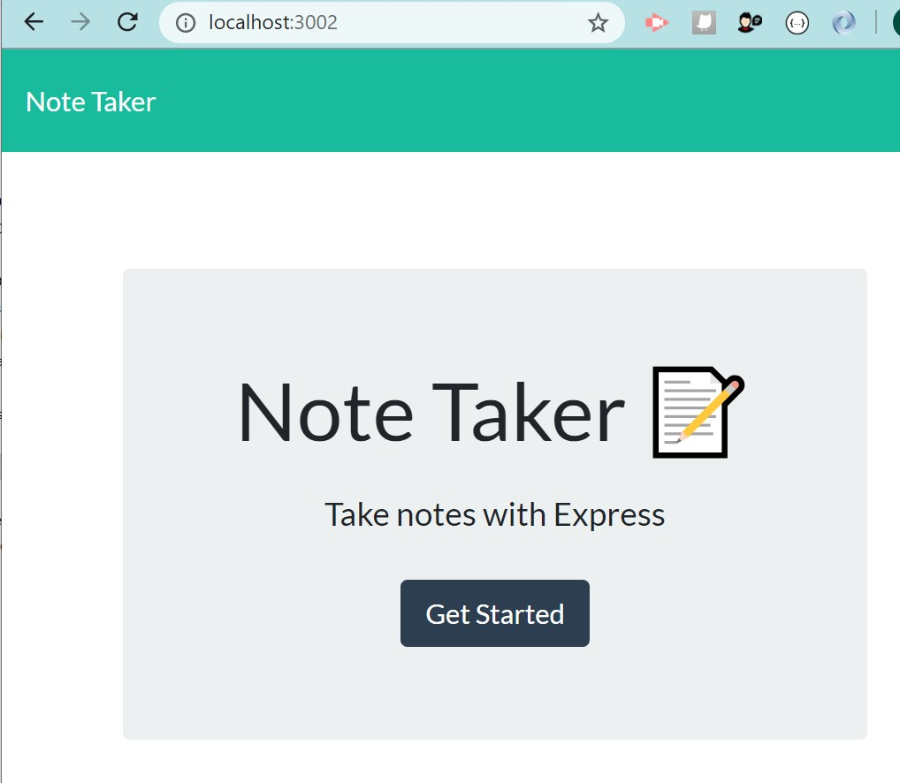

# Note-Taker

## GitHub repository
https://github.com/ktrnthsnr/Note-Taker

## Heroku site
https://ktrnthsn-notetaker.herokuapp.com/

## Table of Contents
* [Description](#description)
* [Installation](#installation)
* [Usage](#usage)
* [Technology](#technology)
* [Contribution](#contribution)

## Description
This application is used to write and save notes, and will use an Express.js backend in the process of saving and retrieving note data from a JSON file. The front-end starter code has been provided with focus of the work for this assignment on connective piece, of creating the routing and connections to the back-end.

## Installation
- If cloning to your repository, to setup, follow these instructions:
- Prereq: install VSCode, Node.js
- After cloning the GitHub repo to your local drive, run the following in the VSCode terminal command-line
- Install npm
- $ npm init -y
- Install Express.js
- $ npm install express --save or $ npm i express
- If you need to re-add the dependencies, run $ npm install
- Create a .gitignore file in the root and add node_modules to this file
- To deploy, first create a Heroku account and then install the CLI https://devcenter.heroku.com/articles/heroku-cli
- Create a new Heroku application by entering, $ heroku create 

## Usage
- To view the application locally before deploying, type in the terminal $ npm start
- Open a browser to http://localhost:3002/

## Technology
Node, JavaScript, ES6, HTML, CSS, npm, Express.js, Heroku

## Contribution
ktrnthsnr

### ©️2020 ktrnthsnr
